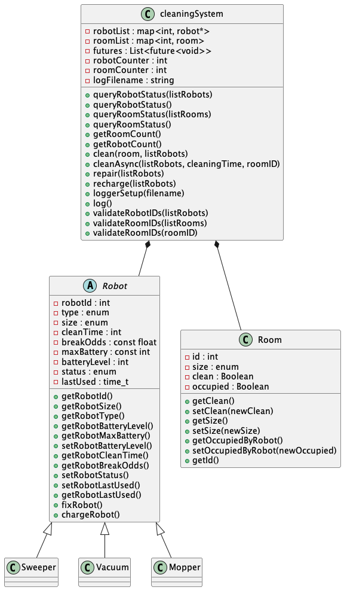

# Robotic Cleaning System Design Hub
Here you will find an overview of the documentation created during and for the development of Team BECA's Robotic Cleaning Software.

## Use Case Diagrams
We developed two use case diagrams which both live in one file that provides information about each as well as information regarding the developer contributions to that portion of the project. The two diagrams separate the uses for the Robot Manager and the Robot itself, which are the two actors involved in our software. 

[The use case diagrams can be found here.](use_cases/usecases.md)

## Sequence Diagrams
We developed a total of 7 sequence diagrams to outline 4 different sections of our program. The first section is the actual cleaning functionality of the robots. This section only has one sequence diagram, but is also one of the more complicated processes in our system. Next we have our robot repair functionality and simulation. This includes three sequence diagrams for dianosing the issue, fixing the robot, and recharging the robot. We also developed a sequence diagram for our logger, which is an independent object that will occasionally snapshot data about our robots and rooms and record them to a csv file. Finally, we have two sequence diagrams for status query functionality. This will enable the user to see the status information for either all robots or all rooms. 

[Sequence diagrams can be found here.](sequence_diagrams/SequenceDiagrams.md)

## Class Diagram
We developed the following class diagram to show the core structure of our program. Our main class is the cleaningSystem class which runs many of the core functions of the program and contains the objects of every robot and room. The robot class has three child classes that currently aid in the streamlining of creating the different types of robots by having separate constructors. 

