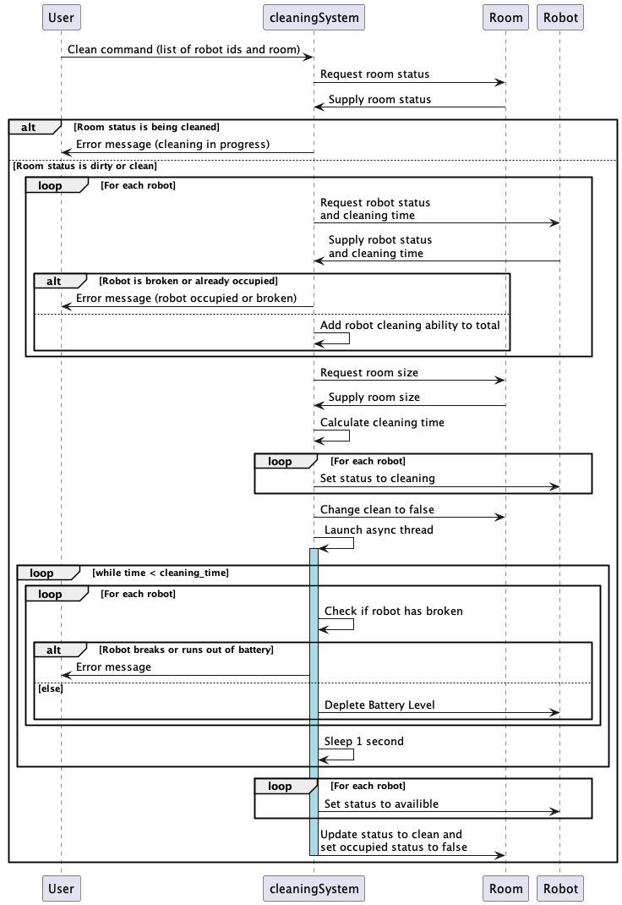
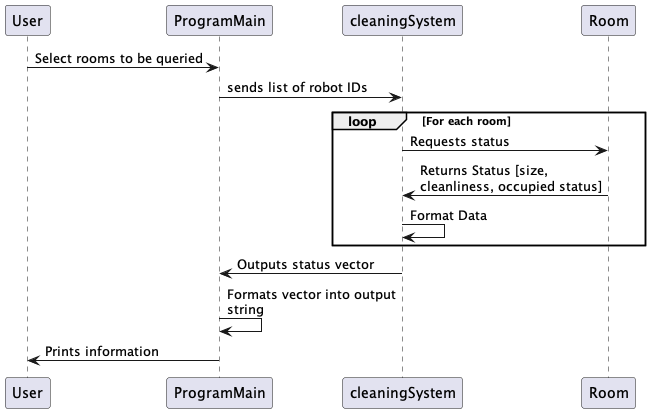

# Sequence Diagrams
This file showcases a number of sequence diagrams that clarify the how the main functions of our system will interact between different actors.

[Click Here to return to the main design documentation file.](../DESIGN.md)
## Clean Room Functionality
This sequence diagram encompasses the complex functionality involved in assigning robots to clean a room, and the following logic to simulate that cleaning.

## Robot Issue Simulation and Resolution
This collection of three sequence diagrams shows how our program will handle simulating the user requesting a diagnosis for a robot, fixing the robot, and recharging the robot.

### Diagnosing Robot Issue
Our robots will have the option to either have run out of battery, or have some sort of system problem that requires them to be fixed by the manager. The diagnose function will take a robot and return what the issue is that has caused a robot to break/stop working

### Fix Robot Command
When a robot has been identified as having some sort of issue that is NOT a battery level issue. The user will be able to run a fix command that will simulate the user fixing the robot and returning it to a ready state.

### Recharge Robot Command
When A robots battery level has fully depleted. the robot will cease working and will require the manager to recharge or replace its batteries. This will be done via a command and a simulated period of time in which the robot is being recharged.

## Logger Object
This sequence diagram shows the functionality containted within the loop that the logger will run on. The logger must collect certain information every x seconds and add that information onto a csv file. The logger will run on an independent thread and run this loop continuously

## Query Room Status
The user will have the ability to request the status of all rooms currently in the system. This will return information back to the user about the room such as cleanliness and size.

## Query Robot Status
The User will also have the ability to request the status of all robots in the system. This will return information such as robot type, activity status, and time last in use.

