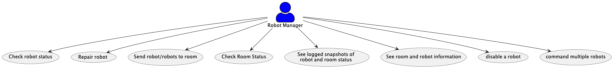
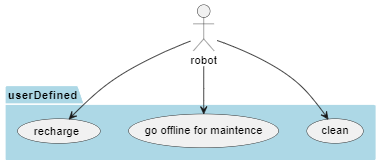

# Use Case Diagrams
This file details the high level use cases that will be availible for the robot actor as well as the robot manager actor when using our software. 

[Click Here to return to the main design documentation file.](DESIGN.md)
## Robot Manager Use Case Diagram
The Robot manager use case outlines the tasks availible to the main user of this software that wants to control and manage the fleet of robots. Use cases include:
1. Check robot status
2. Repair robot
3. Send robot/robots to room
4. Check room status
5. See logged snapshots of robot and room status
6. See room and robot information
7. Disable a robot
8. Command multiple robots

## Robot Use Case Diagram
The Robot use case outlines the user defined tasks available for the robot to execute, which are:
1. Clean (mop, scrub, or vacuum depending on the type of the robot)
2. Go offline for maintnence
3. Recharge

### Developer contributions for part 1 of this project:

Bereket:
I contributed by adding some user stories and by 
modifying the puml diagram.

Aris:
I made the Robot use-case diagram and added some user stories.

Ethan:
I added use cases to the robot manager diagram and added a number of user stories. I also wrote the design.md file and outlined and added the robot manager diagram section to the usecases.md file.

Caitlin 
I contributed to the creation of the user stories and brainstorming the use-case diagrams.

